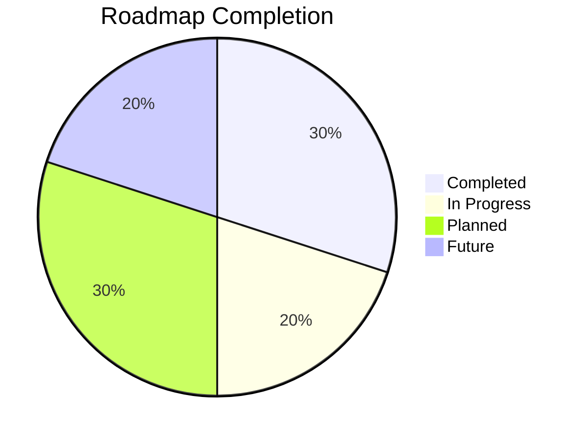
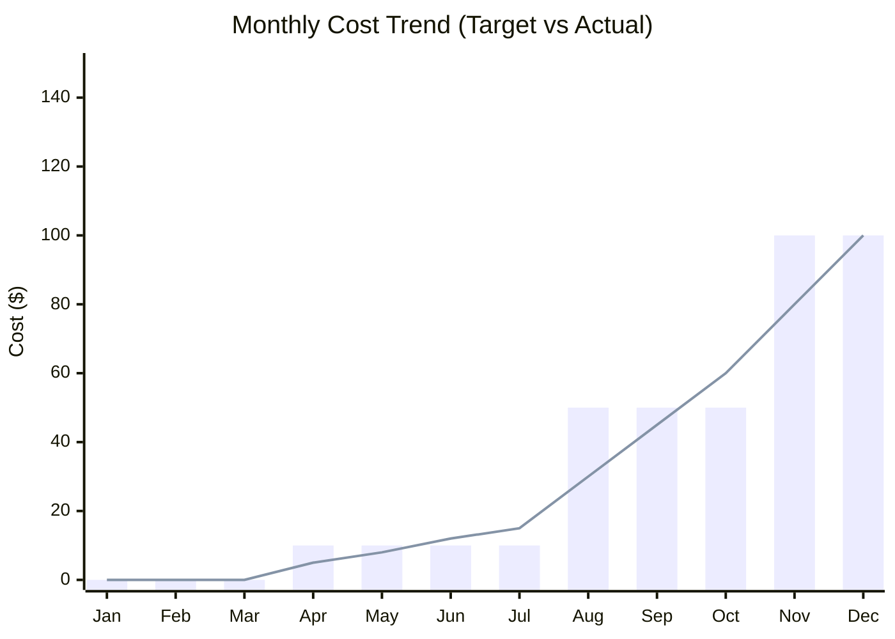

# 🎯 Project Status Dashboard

**Last Updated:** December 21, 2024  
**Repository:** [compliance-governance-test](https://github.com/Heyson315/compliance-governance-test)

---

## 📊 Overall Progress

---

## 🗓️ Current Status: Phase 1 - Quick Wins

### Phase Timeline

| Phase | Start | End | Status | Progress |
|-------|-------|-----|--------|----------|
| **Phase 1: Quick Wins** | Jan 2025 | Apr 2025 | 🟢 Active | 75% |
| **Phase 2: Automation** | Apr 2025 | Jul 2025 | ⚪ Planned | 0% |
| **Phase 3: Scale** | Jul 2025 | Dec 2025 | ⚪ Planned | 0% |
| **Phase 4: Expansion** | Oct 2025 | Mar 2026 | ⚪ Planned | 0% |

---

## ✅ Phase 1: Quick Wins (0-3 Months)

**Target:** Complete by April 2025  
**Budget:** $0-10/month  
**Current Spend:** $0/month ✅

### Tasks

| Task | Status | Progress | Owner | Due Date | Notes |
|------|--------|----------|-------|----------|-------|
| **CI/CD & Security Basics** | ✅ Complete | 100% | @Heyson315 | Feb 2025 | GitHub Actions workflow created |
| **Enable MFA and DLP** | ✅ Complete | 100% | @Heyson315 | Mar 2025 | M365 E5 configured |
| **Cloud on Budget** | ✅ Complete | 100% | @Heyson315 | Mar 2025 | Using free tiers |
| **Compliance Templates** | 🔄 In Progress | 60% | @Heyson315 | Apr 2025 | Policy templates created |

### Deliverables

- [x] `.github/workflows/ci.yml` - CI/CD pipeline
- [x] `validate-cpa-tenant-e5.ps1` - E5 validation script
- [x] `COMPLIANCE-MAPPING.md` - Compliance documentation
- [x] `docs/policies/` - Conditional Access templates
- [ ] Cost monitoring automation (NEW)
- [ ] Complete all policy templates

---

## 📋 Phase 2: Incremental Automation (3-6 Months)

**Target:** April - July 2025  
**Budget:** $10-50/month  
**Current Spend:** Not started

### Tasks

| Task | Status | Progress | Owner | Due Date | Dependencies |
|------|--------|----------|-------|----------|--------------|
| **Finance Automation** | 📋 Planned | 0% | TBD | May 2025 | QuickBooks API access |
| **Data Management** | 📋 Planned | 0% | TBD | Jun 2025 | SharePoint site setup |
| **Security Enhancements** | 📋 Planned | 0% | TBD | Jul 2025 | Phase 1 complete |

### Prerequisites

- [ ] QuickBooks Online subscription
- [ ] QuickBooks Developer account
- [ ] SharePoint site provisioned
- [ ] Phase 1 completion review

---

## 📈 Phase 3: Scale Gradually (6-12 Months)

**Target:** July - December 2025  
**Budget:** $50-150/month  
**Current Spend:** Not started

### Tasks

| Task | Status | Progress | Owner | Due Date | Dependencies |
|------|--------|----------|-------|----------|--------------|
| **Low-Code Tools** | 📋 Planned | 0% | TBD | Sep 2025 | Power Apps license |
| **AI Pilots** | 📋 Planned | 0% | TBD | Dec 2025 | Azure AI credits |

### Research Needed

- [ ] Azure AI Services pricing
- [ ] Power Apps templates
- [ ] AI model selection (GPT-4, Azure OpenAI, etc.)
- [ ] Compliance AI use cases

---

## 🌟 Phase 4: Future Expansion

**Target:** October 2025 - March 2026  
**Budget:** TBD  
**Current Spend:** Not started

### Tasks

| Task | Status | Progress | Owner | Due Date |
|------|--------|----------|-------|----------|
| **Marketplace Strategy** | 🔮 Future | 0% | TBD | Jan 2026 |
| **Advanced AI** | 🔮 Future | 0% | TBD | Mar 2026 |

---

## 📈 Key Metrics

### Cost Tracking

**Legend:**
- 🟦 Bar: Target budget
- 🟨 Line: Actual spend

### Current Month Snapshot

| Metric | Value | Target | Status |
|--------|-------|--------|--------|
| **Total Monthly Cost** | $0.00 | < $10.00 | ✅ Excellent |
| **Azure Spend** | $0.00 | $0.00 | ✅ Free tier |
| **M365 Spend** | $0.00 | $0.00 | ✅ E5 Developer (free) |
| **GitHub Actions** | $0.00 | $0.00 | ✅ Within free tier |
| **QuickBooks** | N/A | N/A | ⏸️ Not started |

---

## 🎯 Milestones

### Completed ✅

- [x] **Jan 15, 2025** - Repository created
- [x] **Dec 21, 2024** - CI/CD workflow deployed
- [x] **Dec 21, 2024** - README updated with badges
- [x] **Dec 21, 2024** - Cost monitoring script created

### Upcoming 📅

- [ ] **Jan 15, 2025** - Complete all Phase 1 policy templates
- [ ] **Feb 1, 2025** - Phase 1 completion review
- [ ] **Apr 1, 2025** - Phase 2 kickoff
- [ ] **May 1, 2025** - QuickBooks API integration POC
- [ ] **Jul 1, 2025** - Phase 3 kickoff

---

## 🚀 Recent Activity

### This Week (Dec 16-21, 2024)

- ✅ Created CI/CD workflow with security scanning
- ✅ Fixed README badge to use correct branch
- ✅ Created cost monitoring script
- ✅ Updated project documentation

### Next Week (Dec 22-28, 2024)

- [ ] Test CI/CD workflow with actual push
- [ ] Review security scan results
- [ ] Complete remaining policy templates
- [ ] Set up automated cost alerts

---

## 🔗 Quick Links

### Documentation
- [README](../README.md)
- [Compliance Mapping](../COMPLIANCE-MAPPING.md)
- [Contributing Guidelines](../CONTRIBUTING.md)

### Policies & Templates
- [Conditional Access Policies](../docs/policies/)
- [Cross-Tenant Configuration](../docs/cross-tenant-access/)
- [E5 Optimization Guide](../docs/e5-optimization-guide.md)

### Tools & Scripts
- [Cost Monitor](../monitor-azure-costs.ps1)
- [E5 Validator](../validate-cpa-tenant-e5.ps1)
- [CA Policy Deployer](../deploy-ca-policy.ps1)

### External Resources
- [GitHub Actions](https://github.com/Heyson315/compliance-governance-test/actions)
- [Azure Portal](https://portal.azure.com)
- [M365 Admin Center](https://admin.microsoft.com)

---

## 📝 Notes

### Budget Philosophy
Following the **"Start Lean"** principle:
1. **Phase 1:** Free tiers only ($0/month)
2. **Phase 2:** Minimal paid services ($10-50/month)
3. **Phase 3:** Strategic scaling ($50-150/month)
4. **Phase 4:** ROI-driven expansion (variable)

### Risk Register

| Risk | Impact | Probability | Mitigation |
|------|--------|-------------|------------|
| Cost overrun in Phase 2 | High | Low | Weekly cost monitoring |
| QuickBooks API delays | Medium | Medium | Start integration early |
| E5 license expiration | High | Low | 90-day renewal reminders |
| Resource constraints | Medium | Medium | Prioritize Phase 1 completion |

---

## 🏆 Success Criteria

### Phase 1
- [ ] All compliance templates completed
- [ ] Zero monthly costs maintained
- [ ] CI/CD pipeline passing
- [ ] Security scan clean

### Phase 2
- [ ] QuickBooks API integrated
- [ ] SharePoint document control operational
- [ ] Costs under $50/month

### Phase 3
- [ ] Power Apps workflow live
- [ ] AI summarization POC successful
- [ ] Costs under $150/month

---

**Dashboard Generated:** December 21, 2024  
**Next Review:** January 15, 2025  
**Project Owner:** Hassan Rahman (@Heyson315)
