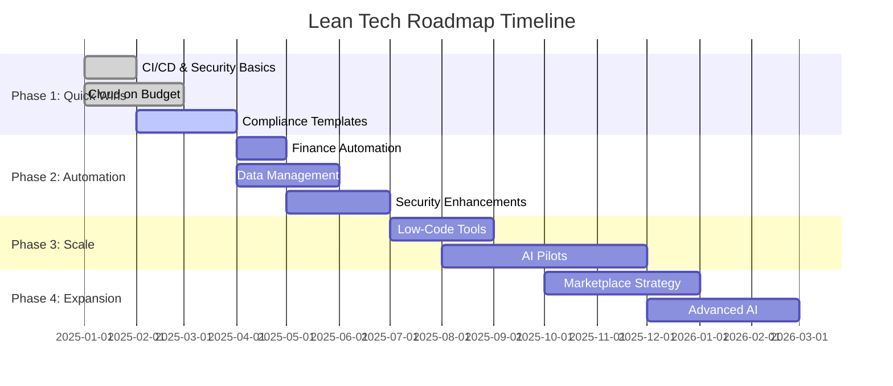
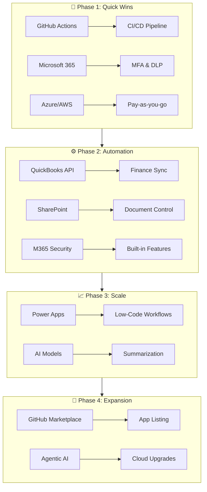
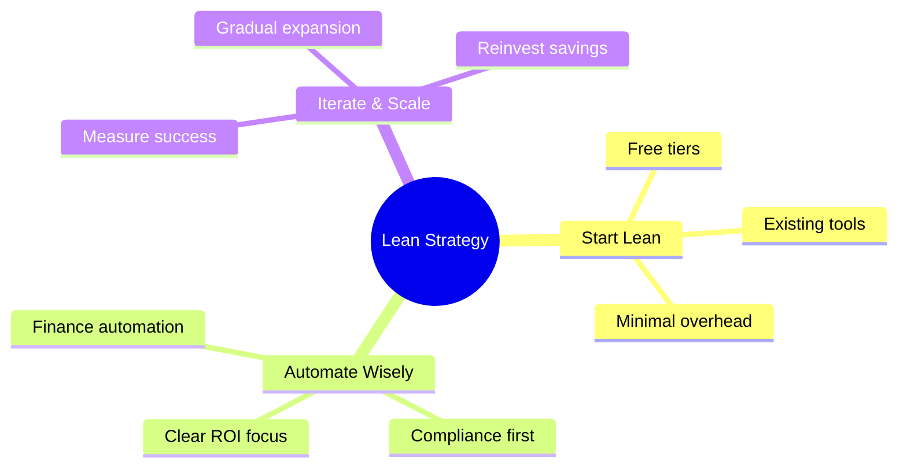

# **Lean Tech Roadmap for AI & Compliance Projects**


---

## **Overview**

This roadmap outlines a **budget-friendly strategy** to integrate AI, automation, and compliance into your projects using **low-cost tools** and **incremental steps**.

---

## 📚 **Documentation**

| Document | Description |
|----------|-------------|
| 🔗 [Cross-Tenant Collaboration Guide](docs/cross-tenant-collab.md) | Complete guide for Microsoft Entra ID cross-tenant access, B2B collaboration, and identity synchronization |
| ⭐ [E5 Optimization Guide](docs/e5-optimization-guide.md) | **NEW** - Maximize Microsoft 365 E5 features for cross-tenant scenarios |
| 🏢 [Solo CPA Testing Guide](docs/solo-cpa-testing-guide.md) | **NEW** - Testing playground for solo CPA practitioners (includes QuickBooks, Dynamics 365) |
| 📊 [Compliance Mapping Document](COMPLIANCE-MAPPING.md) | **NEW** - Complete SOX/GDPR/HIPAA/NIST/AICPA compliance mapping with audit evidence |
| 📋 [CA Policy: MFA for External Users](docs/policies/conditional-access-mfa-external.yaml) | Conditional Access policy template for external user MFA |
| 🚀 [CA Policy: E5-Enhanced Security](docs/policies/conditional-access-mfa-external-e5-enhanced.yaml) | **NEW** - Risk-based CA with device compliance (E5 exclusive) |
| 🎯 [CA Policy: Solo CPA Custom](docs/policies/conditional-access-solo-cpa-custom.yaml) | **NEW** - Custom policy for solo CPA firm (includes QuickBooks/D365 integration) |
| 📘 [Solo CPA Custom Policy Deployment](docs/solo-cpa-custom-policy-deployment.md) | **NEW** - Step-by-step deployment guide for solo CPA custom policy |
| 🤝 [Partner Tenant Configuration](docs/cross-tenant-access/partner-tenant-config.yaml) | Cross-tenant access trust settings template |
| 🔄 [Cross-Tenant Sync Configuration](docs/cross-tenant-sync/source-to-target.yaml) | B2B user lifecycle automation template |

---

## **Visual Roadmap**



---

## **Architecture Overview**



---

## **Phase 1: Quick Wins (0–3 Months)**

| Task | Status | Tools |
|------|--------|-------|
| CI/CD & Security Basics | ✅ Complete | GitHub Actions |
| Enable MFA and DLP | ✅ Complete | Microsoft 365 |
| Cloud on Budget | ✅ Complete | Azure/AWS Pay-as-you-go |
| Compliance Templates | 🔄 In Progress | SOX, GDPR, HIPAA |

### Details:
- **CI/CD & Security Basics**
  - Use **GitHub Actions** for automated builds and secret scanning.
  - Enable **MFA and DLP** in Microsoft 365.
- **Cloud on Budget**
  - Start with **pay-as-you-go tiers** on Azure or AWS.
- **Compliance**
  - Apply **policy templates** for SOX, GDPR, HIPAA manually.

---

## **Phase 2: Incremental Automation (3–6 Months)**

| Task | Status | Tools |
|------|--------|-------|
| Finance Automation | 📋 Planned | QuickBooks API |
| Data Management | 📋 Planned | SharePoint |
| Security Features | 📋 Planned | Microsoft 365 |

### Details:
- **Finance Automation**
  - Integrate **QuickBooks API** for basic data sync.
- **Data Management**
  - Create a **SharePoint site** for document control.
- **Security**
  - Use built-in **Microsoft 365 security features**.

---

## **Phase 3: Scale Gradually (6–12 Months)**

| Task | Status | Tools |
|------|--------|-------|
| Low-Code Tools | 📋 Planned | Power Apps |
| AI Pilots | 📋 Planned | Azure AI / OpenAI |

### Details:
- **Low-Code Tools**
  - Build small workflows with **Power Apps**.
- **AI Pilots**
  - Test **AI summarization** for audits and compliance reports.

---

## **Phase 4: Future Expansion**

| Task | Status | Tools |
|------|--------|-------|
| Marketplace Strategy | 🔮 Future | GitHub Marketplace |
| Advanced AI | 🔮 Future | Agentic AI |

### Details:
- **Marketplace Strategy**
  - Prepare apps for **GitHub Marketplace listing**.
- **Advanced AI**
  - Reinvest savings into **agentic AI** and **cloud upgrades**.

---

## **Key Principles**



| Principle | Description |
|-----------|-------------|
| 🎯 **Start Lean** | Use free tiers and existing tools |
| ⚡ **Automate Where ROI Is Clear** | Focus on compliance and finance first |
| 📊 **Iterate & Scale** | Expand only after measurable success |

---

## **Tools & Resources**

| Tool | Purpose | Link |
|------|---------|------|
|  | CI/CD & security checks | [Docs](https://docs.github.com/actions) |
|  | SharePoint, DLP, MFA | [Docs](https://docs.microsoft.com/microsoft-365) |
|  | Financial data integration | [API Docs](https://developer.intuit.com) |
|  | Low-code automation | [Docs](https://docs.microsoft.com/powerapps) |

---

## **Getting Started**

```bash
# Clone this repository
git clone https://github.com/Heyson315/compliance-governance-test.git

# Navigate to the project
cd compliance-governance-test

# Review the roadmap and start with Phase 1
```

---

## **Contributing**

Contributions are welcome! Please read our [Contributing Guidelines](CONTRIBUTING.md) before submitting a PR.

---

## **License**

This project is licensed under the MIT License - see the [LICENSE](LICENSE) file for details.

---

<p align="center">
  
  
</p>
