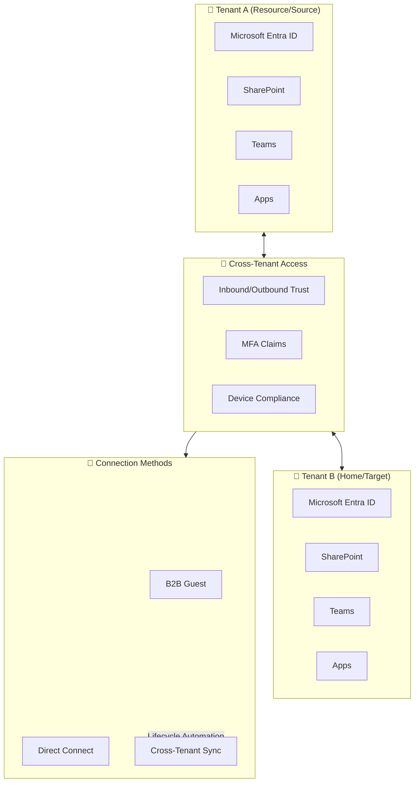
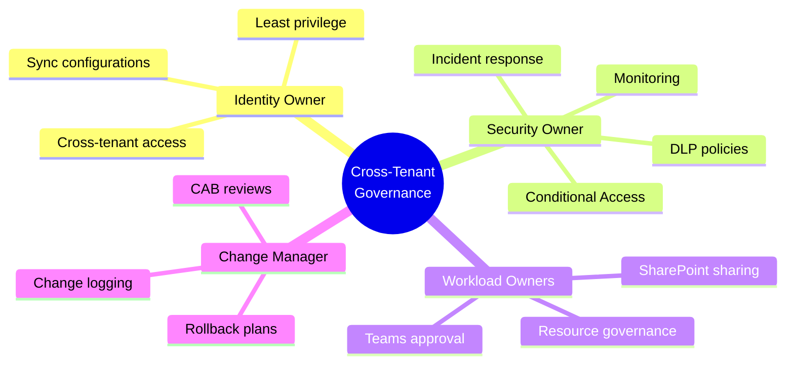
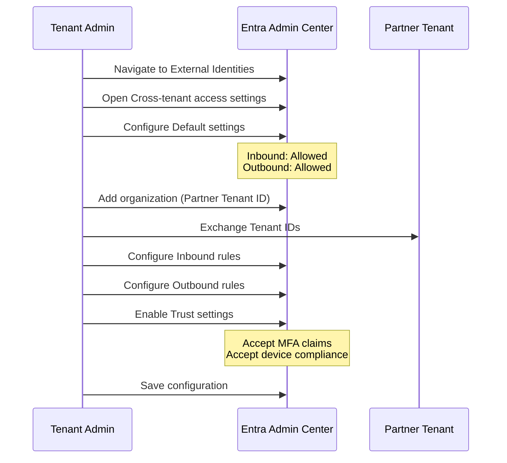
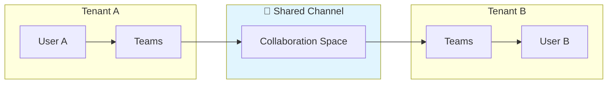
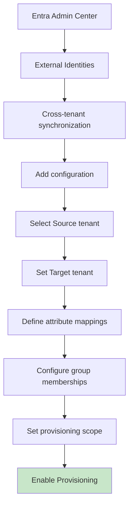
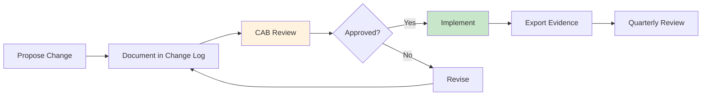

# Cross‑Tenant Collaboration Guide (Microsoft 365 + Entra ID)


> **Goal:** Enable secure collaboration between two or more Microsoft 365 tenants using **Cross‑Tenant Access** (B2B / B2B Direct Connect) and **Cross‑Tenant Synchronization** for automated identity lifecycle.

---

## Contents

- [Audience](#audience)
- [Architecture at a Glance](#architecture-at-a-glance)
- [Prerequisites](#prerequisites)
- [Roles & Responsibilities](#roles--responsibilities)
- [Security Baselines](#security-baselines)
- [Step-by-Step: Cross-Tenant Access](#step-by-step-cross-tenant-access)
- [Optional: B2B Direct Connect](#optional-b2b-direct-connect-teams-shared-channels)
- [Step-by-Step: Cross-Tenant Synchronization](#step-by-step-cross-tenant-synchronization-identity-lifecycle)
- [Conditional Access Policies](#conditional-access-policies-examples)
- [Validation Checklist](#validation-checklist)
- [Troubleshooting](#troubleshooting)
- [Change Control & Audit](#change-control--audit)
- [Appendix: CI/CD Artefacts](#appendix-minimal-artefacts-for-cicd)

---

## Audience

| Role | Responsibility |
|------|----------------|
| 🔐 **Tenant Admins** | Global Admin, Security/Identity Admins |
| 🏢 **MSPs** | Managing multiple client tenants |
| 🔄 **M&A Teams** | Needing immediate collaboration before full migration |

---

## Architecture at a Glance



### Key Principles

```
┌─────────────────────────────────────────────────────────────────────────┐
│  Tenant A (Resource &/or Source)     Tenant B (Home &/or Target)        │
│  -------------------------------     ----------------------------       │
│  Microsoft Entra ID                  Microsoft Entra ID                 │
│  SharePoint / Teams / Apps           SharePoint / Teams / Apps          │
│     ^   Cross-Tenant Access (Inbound/Outbound trust: MFA, device)   ^   │
│     |---------------------------------------------------------------|   │
│     |              B2B (guest)/Direct Connect                       |   │
│     |---------------------------------------------------------------|   │
│     v         Cross-Tenant Synchronization (B2B lifecycle)          v   │
└─────────────────────────────────────────────────────────────────────────┘

Key ideas:
- Keep tenants independent for policy & data residency.
- Trust external MFA/device claims (where appropriate) via Cross‑Tenant Access.
- Automate B2B user lifecycle via Cross‑Tenant Sync (create/update/deprovision).
```

---

## Prerequisites

| Requirement | Details |
|-------------|---------|
| 📄 **Licensing** | Microsoft Entra ID P1/P2 for Cross‑Tenant Sync; Microsoft 365 Business/Enterprise |
| 🔑 **Global Administrator** | Initial setup |
| 🛡️ **Security Administrator** | Cross‑tenant access & CA policies |
| ☁️ **Hybrid Identity Admin** | Sync configuration |
| 📋 **Tenant Info** | Directory (Tenant) IDs for each org |

---

## Roles & Responsibilities



| Role | Responsibility |
|------|----------------|
| **Identity Owner** | Maintains cross‑tenant access and synchronization configurations; ensures least privilege |
| **Security Owner** | Owns Conditional Access, DLP, monitoring, incident response |
| **Workload Owners** | Teams/SharePoint admins—approve which resources are shared |
| **Change Manager** | Logs changes, runs CAB reviews, and maintains rollback plans |

---

## Security Baselines

| Principle | Implementation |
|-----------|----------------|
| 🔒 **Zero‑Trust** | Require MFA for all external users; device compliance signals when possible |
| 🎯 **Least Privilege** | Scope access to specific apps/sites/groups; avoid "allow all" |
| 📊 **Data Protection** | Apply DLP, sensitivity labels, and restricted sharing policies |
| 👁️ **Monitoring** | Enable sign‑in and audit logs; alert on unusual external activity |

---

## Step-by-Step: Cross-Tenant Access

### 1️⃣ Configure External Collaboration Defaults

1. **Entra admin center** → *External Identities* → **External collaboration settings**
   - Define who can invite guests
   - Set guest user permissions & collaboration restrictions

### 2️⃣ Create Cross-Tenant Access Relationships



**Steps:**

1. **Entra admin center** → *External Identities* → **Cross‑tenant access settings**
2. **Default settings**:
   - **Inbound**: Allowed (but later constrained via org settings)
   - **Outbound**: Allowed (ditto)
3. **Organizational settings** → **Add organization** → paste partner **Tenant ID**
4. Configure **Inbound** & **Outbound** rules (per org):
   - **Allowed users/groups/apps**: be specific (security groups for collaboration)
   - **Trust settings**:
     - Accept **MFA claims** from partner tenant
     - Accept **device compliance** / **hybrid join** claims (optional)
5. Save

### 3️⃣ Share Workloads

| Workload | Action |
|----------|--------|
| **Teams** | Invite external guests to specific teams or channels (or use shared channels) |
| **SharePoint** | Share individual sites/libraries with external groups; ensure site‑level policies align |

---

## Optional: B2B Direct Connect (Teams Shared Channels)

> 💡 **Use Case:** Collaborate without traditional guest account switching

### Configuration Steps:

1. Enable **B2B Direct Connect** in Cross‑Tenant Access for both tenants
2. In **Teams admin center**:
   - Allow **Shared Channels** and define external domains/tenants
3. Use **Shared Channels** to collaborate seamlessly



---

## Step-by-Step: Cross-Tenant Synchronization (Identity Lifecycle)

> **Purpose:** Automatically **provision/deprovision B2B users** in the target tenant (no manual invites)

### 1️⃣ Plan Sync Scope

- [ ] Decide **source → target** mapping (which users/groups)
- [ ] Confirm licensing for Cross‑Tenant Sync
- [ ] Document attribute mapping requirements

### 2️⃣ Configure Cross-Tenant Sync



**Steps:**

1. **Entra admin center** → *External Identities* → **Cross‑tenant synchronization**
2. **Add configuration**:
   - Select **Source tenant** (your "home" of identities)
   - Set **Target tenant** (the environment needing guests)
3. Define **attribute mappings**, **group memberships**, and **provisioning scope** (users in specific groups)
4. **Provisioning status**: Set to **On**

### 3️⃣ Lifecycle Controls

| Control | Description |
|---------|-------------|
| ♻️ **Auto‑deprovision** | On user termination in source tenant |
| 🔄 **Reconciliation** | Periodic removal of stale guests |
| 📝 **Exceptions** | Document manual overrides (auditable) |

---

## Conditional Access Policies (Examples)

> ⚠️ Apply in the **resource tenant** hosting the shared apps/sites

### Example 1: Require MFA for External Users

```yaml
name: Require MFA for external users
assignments:
  users: 
    - Guest or external users
    - Directory role or "All guests & external" condition
  cloud_apps:
    - Microsoft Teams
    - SharePoint Online
  conditions:
    locations: Any
    device_platforms: Any
grant:
  - require_multifactor_authentication: true
session:
  sign_in_frequency: 8 hours
```

### Example 2: Trust Partner MFA & Device Compliance

```yaml
name: Trust Partner MFA and Device Compliance
prerequisite:
  cross_tenant_access:
    organizational_settings:
      trust_settings:
        accept_partner_mfa: true
        accept_compliant_device_claims: true
assignments:
  users: External guests from partner
grant:
  - require_compliant_device: true
  - OR require_mfa: true
note: "When trust is enabled, previously satisfied requirements in the partner tenant can be honored"
```

### Example 3: Block High-Risk Sign-ins

```yaml
name: Block High-Risk Sign-ins for External Users
assignments:
  users: Guest/external
  conditions:
    sign_in_risk: High  # Requires Identity Protection
grant:
  - block_access: true
```

---

## Validation Checklist

- [ ] ✅ External user can access **Teams** or **SharePoint** resources as intended
- [ ] 🔐 **MFA prompt behavior** matches design (trust vs local enforcement)
- [ ] 🎯 **Conditional Access** produces expected results (Pass/Block)
- [ ] 📊 **Audit/Sign‑in logs** show cross‑tenant events with correct policies applied
- [ ] ♻️ **Deprovision test** removes external account automatically in target tenant

---

## Troubleshooting

| Issue | Resolution |
|-------|------------|
| 🚫 **External user gets blocked** | Check **Inbound rules** for the partner org and CA policies targeting guests |
| 🔐 **No trust of MFA/compliance** | Verify **Trust settings** in Cross‑Tenant Access for that organization |
| ⚠️ **Sync not provisioning** | Confirm **Provisioning status = On**, attribute mappings, and source group membership |
| 💬 **Teams shared channel fails** | Ensure both tenants enabled **B2B Direct Connect** and allowed shared channels/domain |
| 🌐 **Unexpected broad access** | Tighten scope to **specific apps/groups**, avoid "All users" |

---

## Change Control & Audit



### Requirements:

- ✅ Maintain a **change log** (who/what/when/why)
- ✅ Export **policy JSON** and **screenshots** during changes for evidence
- ✅ Review **quarterly**: scope, trust settings, CA rules, and deprovisioning reports

---

## Appendix: Minimal Artefacts for CI/CD

> Optional: store configuration intents in your repo for repeatability/evidence  
> *(These are templates—replace with your tenant IDs, groups, and app IDs)*

### Related Configuration Files

| File | Purpose |
|------|---------|
| [`policies/conditional-access-mfa-external.yaml`](policies/conditional-access-mfa-external.yaml) | CA policy for external MFA |
| [`cross-tenant-access/partner-tenant-config.yaml`](cross-tenant-access/partner-tenant-config.yaml) | Partner tenant trust configuration |
| [`cross-tenant-sync/source-to-target.yaml`](cross-tenant-sync/source-to-target.yaml) | Sync configuration template |

---

## License

This documentation is licensed under the [MIT License](../LICENSE).

---

<p align="center">
  
  
  
</p>
